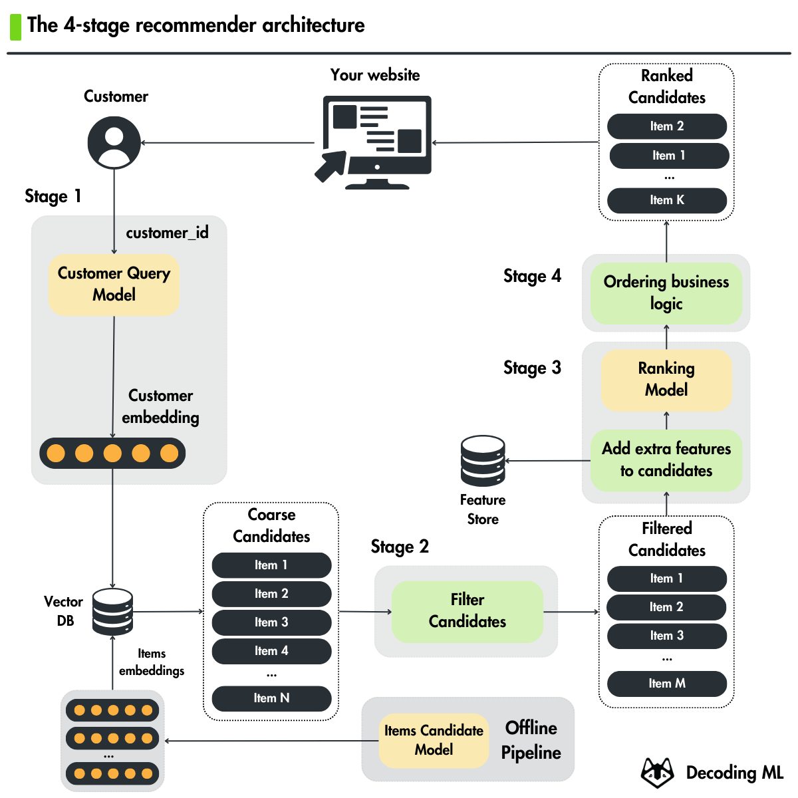
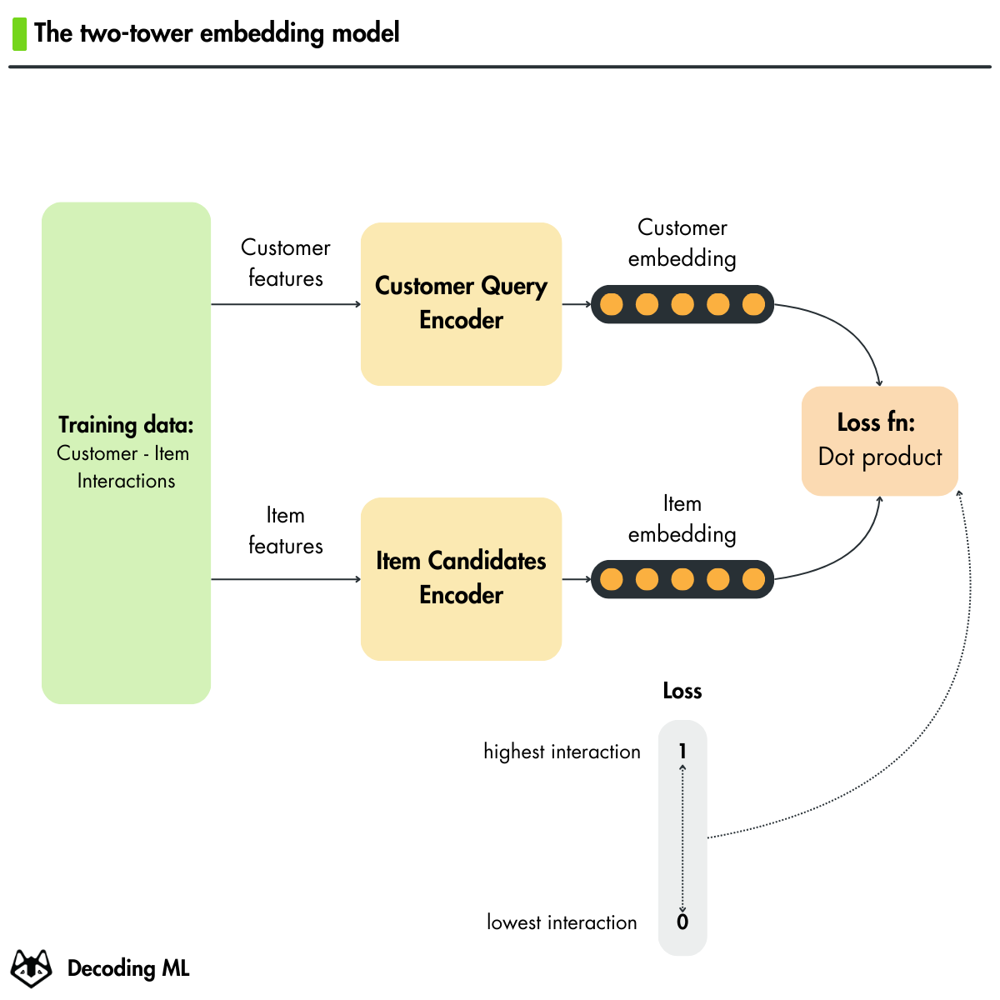

<div align="center">
  <h1>Hands-on H&M Real-Time Personalized Recommender</h1>
</div>

</br>


## 🎯 About This Course

This hands-on course teaches you how to build and deploy a real-time personalized recommender system for H&M fashion articles. You'll learn:

- A practical 4-stage recommender architecture
- Two-tower model implementation and training
- Scalable ML system design principles
- MLOps best practices
- Real-time model deployment
- LLM-enhanced recommendations
- Building an interactive web interface

<p align="center">
  
  
</p>


## 🏗️ Project Structure

```bash
.
├── notebooks/          # Jupyter notebooks for each pipeline
├── recsys/             # Core recommender system package
│   ├── config.py       # Configuration and settings
│   ...
│   └── training/       # Training pipelines code
├── tools/              # Utility scripts
├── streamlit_app.py    # Streamlit app entry point
├── .env.example        # Example environment variables template
├── Makefile            # Commands to install and run the project
├── pyproject.toml      # Project dependencies
```

## License

This course is an open-source project released under the MIT license. Thus, as long you distribute our LICENSE and acknowledge your project is based on our work, you can safely clone or fork this project and use it as a source of inspiration for your educational projects (e.g., university, college degree, personal projects, etc.).
